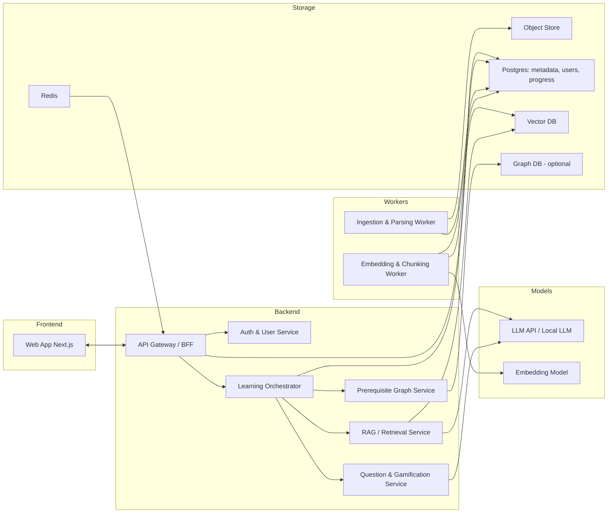

# open_learning_assistant System Design

An Open Source Software that helps you learn complex topic easily with the power of Language models.

## Requirements

- Open Source Software (Linux, MacOS, Windows). Can run via Docker locally and on Cloud platform.
- Students will be able to upload pdf files and txt files and will be able to learn from it.
- They will get a pre-requistite tree, and then they can start learning the topic with ease by clarifying the requirements of that particular topic.
- Gamify dynamic questions for the pre-requisites, as well as the questions in the course to help them understand better what is going on.

---

## 1. High-Level Architecture

* A **frontend** (web app) for students
* A **backend API** that orchestrates everything
* A **background worker** pipeline that ingests & processes content
* Pluggable **LLM & embeddings providers**
* A **vector store + relational DB** + optional graph store

Rough architecture:



---

## 2. Core Services

### 2.1 API Gateway / Backend For Frontend (BFF)

* **Responsibilities**

  * Single entry point for frontend
  * Authentication, routing, rate limiting
  * Aggregates data from other services (learning path, gamification, current lesson)
* **Tech**

  * FastAPI / NestJS / Express
  * Deployed as a container, exposes REST/GraphQL

Key endpoints (example):

* `POST /auth/signup`, `POST /auth/login`
* `POST /materials/upload`
* `GET /materials/:id/prerequisites`
* `GET /learning/session/:id`
* `POST /learning/session/:id/answer`
* `GET /gamification/leaderboard`

---

### 2.2 Auth & User Service

* **Responsibilities**

  * User registration / login (OAuth optional)
  * API tokens / JWTs
  * Stores basic profile + preferences (LLM provider, language, difficulty)

* **Data**

  * `users(id, email, password_hash, name, created_at, settings_json)`
  * `user_settings(theme, preferred_llm, preferred_language, …)`

---

### 2.3 Content Ingestion & Parsing Service

This is a **background worker** (e.g. Celery/RQ/Sidekiq) so uploads don’t block.

* **Responsibilities**

  * Accept PDFs / TXT
  * Extract raw text (PyMuPDF, pdfminer, etc.)
  * Split into **logical sections** (chapters, headings) and **chunk** for RAG
  * Detect topic hierarchy & key concepts per section

* **Steps**

  1. `POST /materials/upload` → API saves file to **Object Store** & creates `learning_material` row with `status='PENDING'`.
  2. Worker picks job → parses PDF → stores plain text + sections in `content_chunks`.
  3. Worker requests embeddings for chunks → stores in **Vector DB**.
  4. Worker calls **Prerequisite Graph Service** to build/augment the topic graph.

* **Tech**

  * Python worker (FastAPI + Celery)
  * Object storage:

    * Local: filesystem volume in Docker
    * Cloud: S3 / MinIO
  * Embeddings:

    * OpenAI / Gemini / local embedding model via sentence-transformers

---

### 2.4 RAG / Retrieval Service

* **Responsibilities**

  * Given a **question** + **current topic**, find relevant chunks
  * Build prompt context for the LLM
  * Provide:

    * `answer`
    * `citations` (chunk IDs / page numbers)
    * `suggested_followups`

* **Flow**

  1. API → `RAG.query(user_id, material_id, topic_node, question)`
  2. RAG:

     * Uses Vector DB (Qdrant/Milvus/pgvector) to search relevant chunks
     * Optionally filters by section/topic tags
     * Constructs prompt → calls LLM
  3. Returns structured response:

     ```json
     {
       "answer": "...",
       "sources": [{ "chunk_id": "...", "page": 12 }],
       "followups": ["Explain this with an analogy", "Give me a quick quiz"]
     }
     ```

* **Tech**

  * Vector DB: Qdrant / pgvector / Chroma
  * Pluggable LLM provider interface:

    * `OpenAIProvider`, `GeminiProvider`, `LocalLLMProvider(vLLM)` etc.

---

### 2.5 Prerequisite Graph Service

This is the core for **“prerequisite tree”**.

* **Concept**

  * A topic graph `T` where nodes = concepts, edges = “A is prerequisite of B”.
  * Can be:

    * **Global** per domain (e.g. “Linear Algebra → Eigenvalues → PCA”)
    * **Material-specific** graphs per uploaded course/book
  * For your OSS, start with **material-specific** (simpler).

* **Responsibilities**

  * Infer topics & relationships from content:

    * Extract headings + summary per section.
    * Use LLM to propose topics + dependencies.
  * Store graph + expose APIs for:

    * `GET /materials/:id/prerequisite-tree`
    * `GET /topics/:id/next` (what to learn next)
    * `GET /topics/:id/parents` (what you should know before this)

* **Storage**

  * Option 1 (simple, in Postgres):

    * `topics(id, material_id, title, description, level, metadata_json)`
    * `topic_edges(id, from_topic_id, to_topic_id, relation_type)`
      where `relation_type = 'PREREQUISITE'`
  * Option 2:

    * Use Neo4j / Memgraph for richer queries (but optional at MVP).

* **LLM usage**

  * Offline pipeline:

    * “Given these sections and summaries, propose a prerequisite graph. Return JSON with topics and edges.”

---

### 2.6 Question Generation & Gamification Service

This is where the **dynamic questions & gamification** live.

**Two pieces:**

1. **Question Bank & Generation**
2. **Gamification & Mastery Tracking**

#### 2.6.1 Question Bank & Generation

* **Responsibilities**

  * Generate questions for:

    * **Prerequisite topics** (diagnostic tests)
    * **Current topic sections** (reinforcement)
  * Question types:

    * MCQ, True/False, Fill in the blank, “explain in your own words”
  * Difficulty & Bloom levels (remember, understand, apply, etc.)

* **Flow**

  1. Called by Learning Orchestrator:
     `QGEN.generate(topic_id, difficulty, count, question_type[])`
  2. QGEN queries RAG for relevant context chunks.
  3. QGEN prompt to LLM: “Generate N questions based on this context, with answers and explanations, in JSON schema.”
  4. Store questions in DB for reuse:

     * `questions(id, topic_id, text, options_json, answer, explanation, difficulty, metadata)`

* **APIs**

  * `POST /questions/generate`
  * `GET /questions/next?topic_id=...&user_id=...`

#### 2.6.2 Gamification & Mastery Tracking

* **Responsibilities**

  * Track **per-user mastery** per topic
  * Award **XP**, badges, streaks
  * Decide **what question to show next**

* **Data**

  * `user_topic_mastery(user_id, topic_id, mastery_score (0-1), last_practiced_at, streak, difficulty_preference)`
  * `user_question_attempts(user_id, question_id, is_correct, response_time_ms, timestamp)`

* **Logic (simple v1)**

  * Start each topic at `mastery_score = 0.3`.
  * Correct answer → +0.1 (cap at 1.0)
  * Incorrect answer → -0.1 (min 0.0)
  * When `mastery_score >= 0.8` → topic considered “mastered”.
  * Show next topic whose prerequisites are all `>= 0.6`.

* **Gamification entities**

  * `user_xp(user_id, xp)`
  * `achievements(user_id, badge_type, unlocked_at)`

---

### 2.7 Learning Orchestrator / Session Service

This is the “brain” coordinating everything for a student session.

* **Responsibilities**

  * Start a learning session from:

    * a topic node
    * or a learning goal (e.g. “I want to understand Transformers” → map to node)
  * Decide what to show next:

    * Explanation (via RAG)
    * Example
    * Question / quiz
  * Use **mastery** and **prerequisite graph** to adapt the path:

    * If user fails a prerequisite question, jump back to parent topic.

* **Session data**

  * `sessions(id, user_id, material_id, current_topic_id, state_json, started_at, last_activity_at)`
  * `session_events(session_id, type, data_json, timestamp)`
    (e.g. “question_asked”, “answer_correct”, “explanation_shown”)

* **Example API**

  * `POST /learning/session/start` (with `material_id`, optional `target_topic_id`)
  * `GET /learning/session/:id/step` → returns next step:

    ```json
    {
      "step_type": "question" | "explanation" | "summary",
      "payload": { ... }
    }
    ```
  * `POST /learning/session/:id/answer` → updates mastery and returns feedback + next step.

---

### 2.8 Analytics / Event Service (v2+)

Optional for MVP, but nice:

* Collect anonymous events:

  * Time spent per topic
  * Difficult topics across users
* Use for:

  * Better default graphs
  * Pre-baked question banks for common subjects

---

## 3. Data Layer Overview

**Relational DB (Postgres)**

* `users`
* `learning_materials` (uploaded files)
* `content_chunks`
* `topics`
* `topic_edges`
* `questions`
* `user_topic_mastery`
* `user_question_attempts`
* `sessions`
* `session_events`
* `achievements`, `user_xp`

**Vector Store**

* Embeddings for `content_chunks`
* Optional: embeddings for `topics` & `questions` (for similarity / recommendations)

**Object Storage**

* Raw PDFs / TXTs
* Cached exports (e.g. summaries, offline packs)

**Cache (Redis)**

* Session state cache
* Recently used RAG results (same question/context)
* Rate limiting

---

## 4. Main Flows

### 4.1 Upload & Index Material

1. User uploads PDF/TXT via FE → `POST /materials/upload`.
2. API stores file in object store, creates `learning_material` row with `status='PENDING'`.
3. Worker:

   * Parses text
   * Splits into sections & chunks
   * Calls embedding model → writes vectors to Vector DB
   * Creates `content_chunks` rows
   * Calls Prerequisite Graph Service:

     * Extracts topics, builds `topics` and `topic_edges`
4. Material becomes `status='READY'`.

---

### 4.2 Start Learning a Topic

1. User selects a material + top-level topic (e.g. “Neural Networks”).
2. API asks Prereq service:

   * `GET /materials/:id/prerequisite-tree`
3. Learning Orchestrator checks `user_topic_mastery`:

   * If prerequisites below threshold:

     * Suggest: “You should review: [Linear Algebra, Calculus basics]” with quick diagnostic quiz.
4. Once prerequisites OK:

   * Start session at the chosen topic.

---

### 4.3 Ask Clarifying Questions While Learning

1. User asks: “I don’t understand backprop, can you explain with a simple analogy?”
2. FE → `POST /learning/session/:id/query`.
3. LEARN → RAG:

   * Retrieve relevant chunks
   * Compose prompt with:

     * User’s previous answers
     * Topic context
4. LLM returns explanation + suggested next steps.
5. Orchestrator logs this as `session_event` and maybe increases `mastery_score` if user rates explanation helpful.

---

### 4.4 Gamified Questions

1. Orchestrator calls QGEN: “Give 5 medium difficulty questions for topic X, focusing on concept Y.”
2. QGEN uses context (+ maybe previous attempts) to generate (or fetch) questions.
3. FE renders them as quizzes (timers, hints, streaks).
4. User submits:

   * API checks answer (MCQ vs LLM-evaluated free text).
   * Updates `user_topic_mastery`, `user_xp`.
   * Returns feedback + explanation + next recommended action.

---

## 5. Deployment & OSS Story

### 5.1 Local (Laptop / Dev) – Docker Compose

* `frontend` (Next.js/React)
* `backend-api` (FastAPI/NestJS)
* `worker` (Celery/RQ)
* `postgres`
* `vector-db` (Qdrant/pgvector)
* `redis`
* `minio` (S3-compatible object store)
* optional `llm` (Ollama/vLLM with an open-source model)

Users can:

* Bring their own API keys (OpenAI, Gemini, etc.)
* Or run fully local if they have GPU/CPU headroom.

### 5.2 Cloud

* Same containers, just on:

  * Kubernetes / ECS / Docker Swarm
* External managed services:

  * RDS/Aurora/Postgres
  * S3
  * Managed Redis
  * Managed Vector DB (Pinecone/Qdrant Cloud/etc.)

Config-driven:

* `LLM_PROVIDER=openai|gemini|local`
* `EMBEDDING_PROVIDER=openai|local`
* `VECTOR_DB=qdrant|pgvector|pinecone`

---
